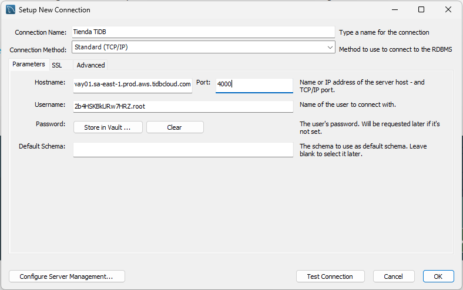

# Tienda App

Link del ejercicio desplegado: https://tienda-app-eight.vercel.app/

Aplicación web básica en Node.js + Express para probar una base de datos TiDB Cloud (compatible con MySQL) con 3 tablas: clientes, productos y pedidos.

## Integrantes

- Laura Daniela Guevara Uribe
- Luis Esteban Robelto Zarabanda
- Laura Valentina Urueña Bejarano
- Sergio Alexander Gómez Zapata


## Requisitos

- Node.js instalado (https://nodejs.org)

## Instalación

1. **Obtener el proyecto:**
   - **Opción A (usando Git):** Abre una terminal y clona el repositorio ejecutando:
     ```bash
     git clone https://github.com/laurva16/TiDB-Electiva-I.git
     cd TiDB-Electiva-I
     ```
   - **Opción B (sin Git):** Haz clic en el botón **Code** arriba a la derecha en GitHub, selecciona **Download ZIP**, descomprime el archivo en tu equipo y entra a la carpeta extraída.

2. Abre una terminal en la carpeta del proyecto y ejecuta:

   ```
   npm install
   ```

3. Crea un archivo llamado `.env` en la raíz del proyecto.
4. Los datos reales de conexión (host, usuario, contraseña, etc.) y el certificado `ca-cert.pem` se entregan aparte, ya que corresponden a la misma base de datos compartida usada para las pruebas. Coloca el `ca-cert.pem` recibido en la raíz del proyecto y completa el `.env` con los valores indicados en ese documento, siguiendo este formato:

   ```
   DB_HOST=tu-host.tidbcloud.com
   DB_PORT=4000
   DB_USER=tu-usuario
   DB_PASSWORD=tu-password
   DB_NAME=tienda
   DB_CA_PATH=./ca-cert.pem
   PORT=3000
   ```

## Evidencia de creación de la base de datos

La base de datos fue creada en **TiDB Cloud** (plan gratuito Starter), en un clúster llamado `db-prueba-electiva-I`, activo en la región de São Paulo (AWS):


Para crear y verificar las tablas (`clientes`, `productos`, `pedidos`) se utilizó **MySQL Workbench**, conectado directamente al clúster de TiDB Cloud mediante conexión SSL. La siguiente captura muestra los scripts `CREATE TABLE` e `INSERT` ejecutados, junto con el resultado de una consulta `SELECT * FROM clientes`:


### Datos de conexión

Los parámetros de conexión (host, puerto, usuario, contraseña y nombre de la base de datos) no se incluyen directamente en este código por motivos de seguridad. Se configuran mediante variables de entorno en el archivo `.env` (ver documento PDF, donde se encuentran los parametros necesarios).

El certificado `ca-cert.pem`, requerido por TiDB Cloud para la conexión SSL, se adjunta por fuera del repositorio (junto con el archivo PDF con los valores reales) para que el docente pueda ejecutar y probar el proyecto sin necesidad de generar sus propias credenciales.

## Estructura del proyecto

Así debe quedar organizada la carpeta del proyecto:


## Ejecutar la aplicación

```
npm start
```

Luego abre en el navegador: http://localhost:3000

## Funcionalidad

- **Clientes**: ver, agregar, actualizar y eliminar clientes.
- **Productos**: ver, agregar, actualizar y eliminar productos.
- **Pedidos**: ver, agregar, actualizar y eliminar pedidos, relacionando cliente y producto.

## Paso a paso para comprobar desde MySQL Workbench

Si deseas verificar la base de datos o ejecutar consultas directamente desde **MySQL Workbench**, sigue estos pasos para configurar la conexión SSL con TiDB Cloud:

1. **Crear una nueva conexión:**
   - Abre MySQL Workbench y haz clic en el icono **`+`** al lado de *MySQL Connections*.

2. **Configurar la pestaña Parameters:**
   - **Connection Name:** Asigna un nombre a la conexión (ej. `Tienda TiDB`).
   - **Connection Method:** Selecciona `Standard (TCP/IP)`.
   - **Hostname:** Ingresa el host de TiDB Cloud (ej. `gateway01.sa-east-1.prod.aws.tidbcloud.com`).
   - **Port:** Indica el puerto `4000`.
   - **Username:** Ingresa tu usuario de TiDB (ej. `2b4HSKBkURw7HRZ.root`).
   - **Password:** Haz clic en **Store in Vault...** e ingresa la contraseña correspondiente.

   

3. **Configurar la conexión SSL (Pestaña SSL):**
   - Ve a la pestaña **SSL** en la parte superior.
   - En la opción **Use SSL**, selecciona `Require`.
   - En el campo **SSL CA File**, haz clic en el botón de búsqueda `...` y selecciona el archivo `ca-cert.pem`.

   

4. **Probar y guardar la conexión:**
   - Haz clic en el botón **Test Connection** abajo a la derecha. Si todo está correcto, aparecerá un mensaje de conexión exitosa.
   - Haz clic en **OK** para guardar la conexión.

5. **Verificar las tablas:**
   - Abre la conexión recién creada y ejecuta consultas para comprobar los datos:
     ```sql
     USE tienda;
     SELECT * FROM clientes;
     SELECT * FROM productos;
     SELECT * FROM pedidos;
     ```

## Dificultades durante el desarrollo

Uno de los retos principales estuvo relacionado directamente con la base de datos: TiDB Cloud exige que toda conexión se haga obligatoriamente por SSL, usando un certificado CA (`ca-cert.pem`) proporcionado por el propio servicio. Al principio la conexión desde la aplicación fallaba porque no se estaba cargando correctamente ese certificado. Además, al intentar desplegar la aplicación en Vercel, el archivo `ca-cert.pem` no podía subirse al repositorio (por ser un archivo sensible ligado a la conexión), por lo que fue necesario adaptar el código para leer el contenido del certificado desde una variable de entorno (`DB_CA_CONTENT`) en lugar de depender de un archivo físico, permitiendo así que la app se conectara a la base de datos tanto en local como en producción sin comprometer las credenciales.
